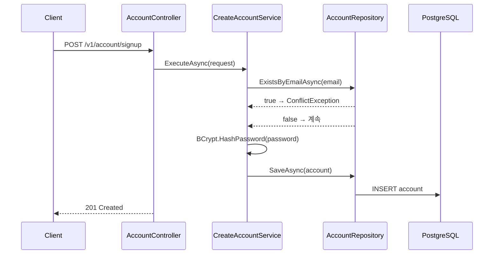
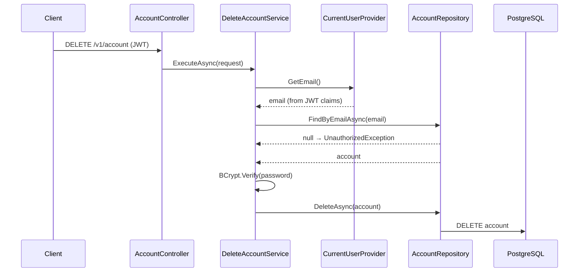
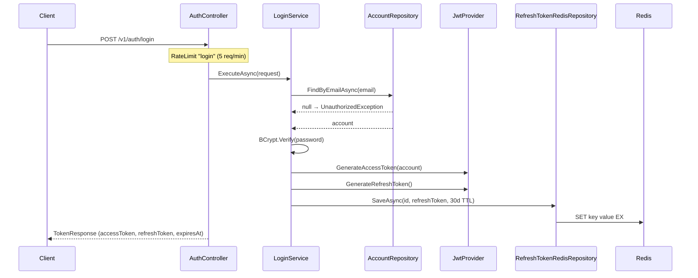
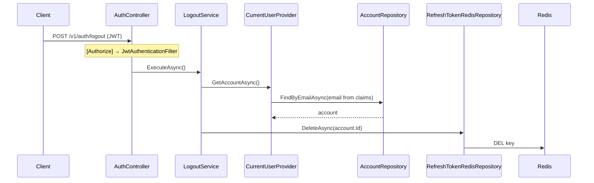

## API Flow Diagrams

### POST /v1/account/signup — 회원가입

```mermaid
sequenceDiagram
    Client->>AccountController: POST /v1/account/signup
    AccountController->>CreateAccountService: ExecuteAsync(request)
    CreateAccountService->>AccountRepository: ExistsByEmailAsync(email)
    AccountRepository-->>CreateAccountService: true → ConflictException
    AccountRepository-->>CreateAccountService: false → 계속
    CreateAccountService->>CreateAccountService: BCrypt.HashPassword(password)
    CreateAccountService->>AccountRepository: SaveAsync(account)
    AccountRepository->>PostgreSQL: INSERT account
    AccountController-->>Client: 201 Created
```

### DELETE /v1/account — 회원탈퇴

```mermaid
sequenceDiagram
    Client->>AccountController: DELETE /v1/account (JWT)
    AccountController->>DeleteAccountService: ExecuteAsync(request)
    DeleteAccountService->>CurrentUserProvider: GetEmail()
    CurrentUserProvider-->>DeleteAccountService: email (from JWT claims)
    DeleteAccountService->>AccountRepository: FindByEmailAsync(email)
    AccountRepository-->>DeleteAccountService: null → UnauthorizedException
    AccountRepository-->>DeleteAccountService: account
    DeleteAccountService->>DeleteAccountService: BCrypt.Verify(password)
    DeleteAccountService->>AccountRepository: DeleteAsync(account)
    AccountRepository->>PostgreSQL: DELETE account
```

### POST /v1/auth/login — 로그인

```mermaid
sequenceDiagram
    Client->>AuthController: POST /v1/auth/login
    Note over AuthController: RateLimit "login" (5 req/min)
    AuthController->>LoginService: ExecuteAsync(request)
    LoginService->>AccountRepository: FindByEmailAsync(email)
    AccountRepository-->>LoginService: null → UnauthorizedException
    AccountRepository-->>LoginService: account
    LoginService->>LoginService: BCrypt.Verify(password)
    LoginService->>JwtProvider: GenerateAccessToken(account)
    LoginService->>JwtProvider: GenerateRefreshToken()
    LoginService->>RefreshTokenRedisRepository: SaveAsync(id, refreshToken, 30d TTL)
    RefreshTokenRedisRepository->>Redis: SET key value EX
    AuthController-->>Client: TokenResponse (accessToken, refreshToken, expiresAt)
```

### POST /v1/auth/logout — 로그아웃

```mermaid
sequenceDiagram
    Client->>AuthController: POST /v1/auth/logout (JWT)
    Note over AuthController: [Authorize] → JwtAuthenticationFilter
    AuthController->>LogoutService: ExecuteAsync()
    LogoutService->>CurrentUserProvider: GetAccountAsync()
    CurrentUserProvider->>AccountRepository: FindByEmailAsync(email from claims)
    AccountRepository-->>CurrentUserProvider: account
    LogoutService->>RefreshTokenRedisRepository: DeleteAsync(account.Id)
    RefreshTokenRedisRepository->>Redis: DEL key
```
